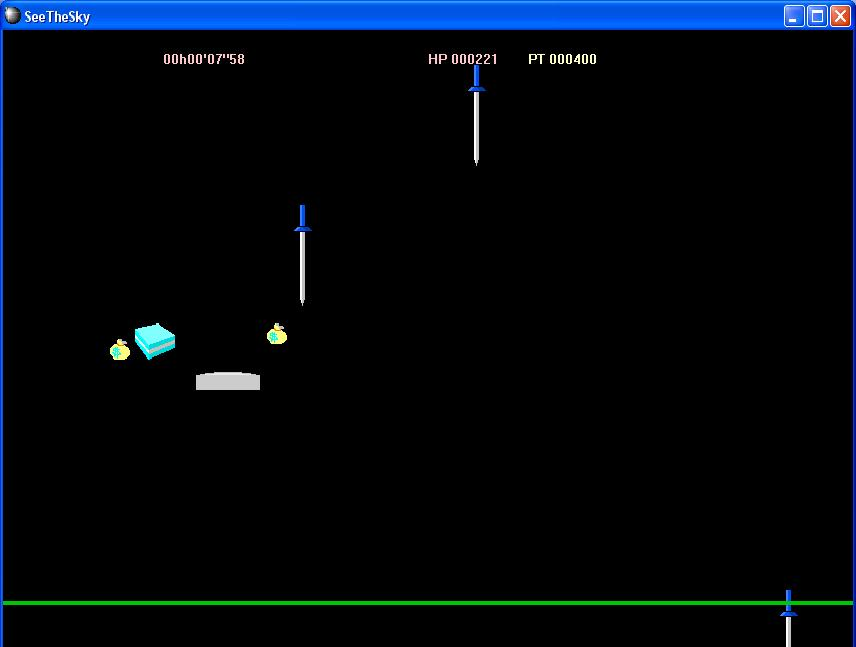

# see-the-sky

一款用C++开发的动作小游戏。

只使用了标准Windows GUI库，没有使用任何第三方图形库。

这是我2006年9月开发完成的。

## 编译方法

用Visual Studio打开`SeeTheSky.sln`，根据VS的版本自动转换后，直接编译即可。

## 游戏方法

用键盘左右键移动白色平板，用↑键跳起。接到天空降落的剑会损失生命值，接住蛋糕会恢复生命值。目标是接住尽量多的钱袋。
